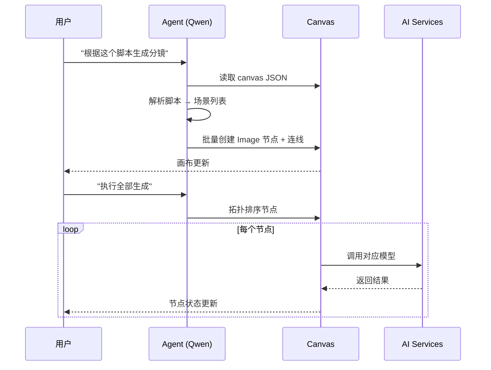

# TapNow Clone — 产品需求文档 (PRD)

> 版本：v0.1 MVP  
> 日期：2026-07-01  
> 目标：1 人最低成本复刻 TapNow 核心体验

---

## 1. 产品概述

### 1.1 产品定位

**TapFlow Clone**（暂定名）是一款 Agentic Creative Canvas —— 基于无限节点画布的 AI 创作工作台。用户通过连接文本、图片、音频、视频节点，构建非线性创作流水线，由 AI Agent 辅助编排与生成。

### 1.2 目标用户

| 用户群 | 痛点 | 我们的价值 |
|--------|------|-----------|
| 独立创作者 | 多工具切换、流程碎片化 | 一个画布完成脚本→分镜→成片 |
| 短视频运营 | 批量产出效率低 | 模板化节点组 + Agent 自动化 |
| 广告/电商 | 创意迭代慢 | 同节点多模型对比（二期） |
| AI 爱好者 | 想学习 ComfyUI 式工作流 | 更低门槛的可视化编排 |

### 1.3 与 TapNow 的差异策略

| 维度 | TapNow 原版 | 我们的 MVP |
|------|-------------|-----------|
| AI 模型 | 35+ 国际前沿模型 | 3–5 个国内免费模型 |
| 社区 | TapTV Fork/Remix | 暂不做，Phase 5 模板市场 |
| 计费 | Credits 订阅 | 自用免费，后期可选 |
| 视频质量 | Sora/Kling 级 | 通义万相/CogVideo 级 |
| 核心体验 | 画布 + Agent + 多模型 | **画布 + 简化 Agent**（优先） |

---

## 2. 核心概念

```
Node（节点）  = 想法的原子单元（文本/图片/音频/视频）
Wire（连线）  = 数据流向（上游输出 → 下游输入）
Group（分组） = 可复用的工作流片段（Phase 3）
Canvas（画布）= 无限缩放创作空间
Agent         = 理解画布、执行指令的 AI 导演（Phase 2）
```

---

## 3. 功能需求

### 3.1 Phase 1 — 画布内核（当前 Sprint）✅

| ID | 功能 | 优先级 | 验收标准 |
|----|------|--------|----------|
| F1.1 | 无限画布 | P0 | 支持缩放(0.1x–2x)、平移、小地图 |
| F1.2 | 节点创建 | P0 | 工具栏可添加 Text/Image/Video/Audio 四类节点 |
| F1.3 | 节点编辑 | P0 | 双击或面板编辑 prompt/内容 |
| F1.4 | 节点连线 | P0 | 拖拽 handle 连接，有向边，不可自环 |
| F1.5 | 节点删除 | P0 | 选中 + Delete 键，级联删除关联边 |
| F1.6 | 画布持久化 | P0 | localStorage 自动保存 + JSON 导入/导出 |
| F1.7 | 项目信息 | P1 | 项目名称、创建/修改时间 |

### 3.2 Phase 2 — AI 生成

| ID | 功能 | 优先级 | 验收标准 |
|----|------|--------|----------|
| F2.1 | 文生图 | P0 | Image 节点调用通义万相，显示结果 |
| F2.2 | 图生视频 | P0 | Video 节点读取上游 Image，调用万相 I2V |
| F2.3 | TTS | P0 | Audio 节点将上游 Text 转语音（Edge-TTS） |
| F2.4 | 任务队列 | P0 | 异步生成，节点显示 loading/done/error |
| F2.5 | 上游数据传递 | P0 | 连线自动注入 prompt/图片 URL 到下游 |

### 3.3 Phase 3 — Agent

| ID | 功能 | 优先级 | 验收标准 |
|----|------|--------|----------|
| F3.1 | Agent 对话 | P0 | 右侧 Chat 面板，Qwen-Plus 驱动 |
| F3.2 | 画布感知 | P0 | Agent 读取当前 nodes/edges JSON |
| F3.3 | 脚本→分镜 | P0 | 输入脚本，自动创建分镜节点树 |
| F3.4 | 节点操作 | P1 | Agent 可创建/修改/删除节点 |
| F3.5 | 批量生成 | P1 | 「执行整个工作流」按拓扑序触发 |

### 3.4 Phase 4 — 产品化

| ID | 功能 | 优先级 |
|----|------|--------|
| F4.1 | 用户注册/登录 | P0 |
| F4.2 | 云端项目列表 | P0 |
| F4.3 | FFmpeg 视频合成 | P1 |
| F4.4 | 多模型切换 | P1 |
| F4.5 | Group 分组 | P2 |

### 3.5 Phase 5 — 社区（可选）

| ID | 功能 | 优先级 |
|----|------|--------|
| F5.1 | 公开画布分享 | P2 |
| F5.2 | Fork/Remix | P2 |
| F5.3 | 模板市场 | P2 |

---

## 4. 信息架构

```
App
├── Home（项目列表）          [Phase 4]
├── Canvas（创作画布）        [Phase 1] ← 当前
│   ├── Toolbar（节点工具栏）
│   ├── FlowCanvas（无限画布）
│   ├── NodePanel（节点属性面板）
│   └── AgentChat（Agent 对话） [Phase 2]
└── Settings（API Key 配置）  [Phase 2]
```

---

## 5. 线框图

### 5.1 整体布局

```
┌─────────────────────────────────────────────────────────────────────┐
│  ◉ TapFlow          [项目名称 ▼]              [导出] [导入] [保存]  │
├────────┬──────────────────────────────────────────────┬─────────────┤
│        │                                              │             │
│  工具栏 │              无限画布区域                     │  属性面板   │
│        │                                              │             │
│ ┌────┐ │    ┌──────────┐      ┌──────────┐          │  节点类型   │
│ │ T  │ │    │ 📝 Text  │─────▶│ 🖼 Image │          │  Text       │
│ │文本│ │    │  脚本...  │      │ prompt.. │          │             │
│ └────┘ │    └──────────┘      └────┬─────┘          │  Prompt:    │
│ ┌────┐ │                           │                 │  [_______]  │
│ │ I  │ │                      ┌────▼─────┐           │             │
│ │图片│ │                      │ 🎬 Video │           │  模型:      │
│ └────┘ │                      │ 4s clip  │           │  [wanx ▼]  │
│ ┌────┐ │                      └──────────┘           │             │
│ │ V  │ │                                              │  状态: idle │
│ │视频│ │         ┌ ─ ─ ─ ─ ─ ─ ─ ─ ─ ─ ┐            │             │
│ └────┘ │         │   Agent Chat [P2]    │            │  [▶ 生成]   │
│ ┌────┐ │         └ ─ ─ ─ ─ ─ ─ ─ ─ ─ ─ ┘            │             │
│ │ A  │ │                                              │             │
│ │音频│ │  [−] 100% [+]                    [小地图]    │             │
│ └────┘ │                                              │             │
├────────┴──────────────────────────────────────────────┴─────────────┤
│  状态栏: 4 nodes · 3 edges · 上次保存 12:30                          │
└─────────────────────────────────────────────────────────────────────┘
```

### 5.2 节点类型设计

```
┌─ Text Node ──────────────┐   ┌─ Image Node ─────────────┐
│ 📝 文本                   │   │ 🖼 图片                    │
│ ┌──────────────────────┐ │   │ ┌──────────────────────┐  │
│ │ 一段产品广告脚本...    │ │   │ │   [生成的图片预览]    │  │
│ └──────────────────────┘ │   │ └──────────────────────┘  │
│ ○ out                    │   │ ○ in          ○ out      │
└──────────────────────────┘   └──────────────────────────┘

┌─ Video Node ─────────────┐   ┌─ Audio Node ─────────────┐
│ 🎬 视频                   │   │ 🔊 音频                    │
│ ┌──────────────────────┐ │   │ ┌──────────────────────┐  │
│ │   [视频预览/占位]      │ │   │ │   ▶ ━━━━━━━ 0:04     │  │
│ └──────────────────────┘ │   │ └──────────────────────┘  │
│ ○ in          ○ out      │   │ ○ in                      │
└──────────────────────────┘   └──────────────────────────┘
```

### 5.3 典型工作流

```
                    ┌─────────────┐
                    │  📝 广告脚本  │
                    └──────┬──────┘
                           │
              ┌────────────┼────────────┐
              ▼            ▼            ▼
        ┌──────────┐ ┌──────────┐ ┌──────────┐
        │ 🖼 分镜1  │ │ 🖼 分镜2  │ │ 🖼 分镜3  │
        └────┬─────┘ └────┬─────┘ └────┬─────┘
             │            │            │
             ▼            ▼            ▼
        ┌──────────┐ ┌──────────┐ ┌──────────┐
        │ 🎬 片段1  │ │ 🎬 片段2  │ │ 🎬 片段3  │
        └────┬─────┘ └────┬─────┘ └────┬─────┘
             └────────────┼────────────┘
                          ▼
                    ┌──────────┐
                    │ 🔊 配音   │ ← 来自脚本 Text
                    └────┬─────┘
                         ▼
                    ┌──────────┐
                    │ 📦 合成   │ [Phase 4: FFmpeg]
                    └──────────┘
```

### 5.4 Agent 交互流程（Phase 2）



---

## 6. 数据模型

### 6.1 CanvasProject

```typescript
interface CanvasProject {
  id: string;
  name: string;
  createdAt: string;
  updatedAt: string;
  nodes: CanvasNode[];
  edges: CanvasEdge[];
  groups: CanvasGroup[];      // Phase 4
  viewport: Viewport;
}

interface CanvasNode {
  id: string;
  type: 'text' | 'image' | 'video' | 'audio';
  position: { x: number; y: number };
  data: NodeData;
}

interface NodeData {
  label: string;
  prompt: string;
  model?: string;
  outputUrl?: string;
  outputText?: string;
  status: 'idle' | 'generating' | 'done' | 'error';
  errorMessage?: string;
  duration?: number;          // video/audio seconds
}

interface CanvasEdge {
  id: string;
  source: string;
  target: string;
  sourceHandle?: string;
  targetHandle?: string;
}
```

### 6.2 存储策略

| 阶段 | 方案 |
|------|------|
| Phase 1 | localStorage (`tapflow_project`) |
| Phase 4 | PostgreSQL + MinIO/OSS |

---

## 7. 技术架构

```
Frontend (Phase 1 当前)
├── Vite + React 18 + TypeScript
├── @xyflow/react (画布引擎)
├── Zustand (状态管理)
└── Tailwind CSS (样式)

Backend (Phase 2 起)
├── FastAPI / Node Fastify
├── BullMQ + Redis (任务队列)
├── PostgreSQL
├── MinIO (文件存储)
└── AI Adapter Layer
    ├── QwenAdapter (文本/Agent)
    ├── WanxAdapter (文生图/图生视频)
    ├── CogVideoAdapter (备选视频)
    └── EdgeTTSAdapter (语音)
```

---

## 8. AI 模型配置

| 场景 | 模型 | 平台 | 免费额度 |
|------|------|------|----------|
| Agent/文本 | qwen-plus | 阿里云百炼 | 100万 Token |
| 文生图 | wanx-v1 | 阿里云百炼 | 新用户试用 |
| 图生视频 | wanx-i2v | 阿里云百炼 | 新用户试用 |
| 文生视频(备选) | cogvideox | 智谱 AI | ~5条/天 |
| TTS | edge-tts | 开源本地 | 完全免费 |

---

## 9. 非功能需求

| 维度 | 要求 |
|------|------|
| 性能 | 画布 100 节点内流畅（60fps 平移缩放） |
| 兼容 | Chrome 90+、Safari 15+、Edge 90+ |
| 存储 | 单项目 JSON < 5MB（不含媒体文件） |
| 安全 | API Key 仅存后端/env，不暴露前端 |
| 可用性 | 自动保存间隔 3s，防丢失 |

---

## 10. 里程碑

| 阶段 | 时间 | 交付物 |
|------|------|--------|
| **Phase 1** | W1–W2 | 画布 MVP（本 Sprint） |
| Phase 2 | W3–W4 | AI 生成 + 队列 |
| Phase 3 | W5–W6 | Agent 对话 + 脚本分镜 |
| Phase 4 | W7–W10 | 用户系统 + 合成导出 |
| Phase 5 | W11+ | 模板市场（可选） |

---

## 11. 成功指标 (MVP)

| 指标 | 目标 |
|------|------|
| 画布操作 | 创建/连线/保存全流程 < 2min 上手 |
| 工作流 | 脚本→3分镜→3视频 端到端可跑通 |
| 成本 | 月运营成本 < ¥150 |
| 稳定性 | 生成任务成功率 > 90% |

---

## 附录 A：竞品参考

- [TapNow 官网](https://app.tapnow.ai/home)
- [TapNow Manifesto](https://www.tapnow.ai/manifesto)
- [ToolCenter 2026 评测](https://www.toolcenter.ai/en/articles/tapnow-ai-review-2026)

## 附录 B：名词对照

| TapNow | 我们 |
|--------|------|
| Tapflow Canvas | Flow Canvas |
| TapNow Agent | Flow Agent |
| TapTV | Flow Gallery (Phase 5) |
| Credits | 暂不计费 |
